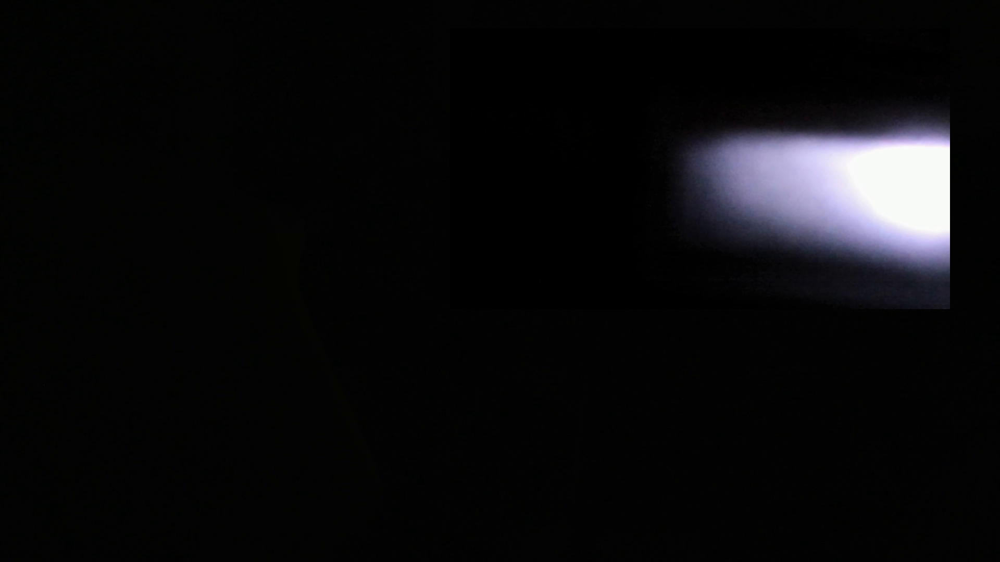

# NV12-output blend validation and finite PiP proof [PARTIAL]

## Two defects, two different bases

R0 (`1.10.1_[4]`, source `5a97e650a30b7c7036eb5aa26e39f2d09f18fcc9`)
rejects a valid RGB pattern with an NV12 destination. In
`im2d_api/src/im2d_impl.cpp:1109–1118`, the `else if (!dst_isRGB)` belongs to
`if (valid_pat && !pat_isRGB)`. A valid RGB pattern makes the first condition
false, so the NV12 output is wrongly tested as the background.

The minimal ordering repair is already inherited in R1, not a new first-party
fix: Rockchip's [fc3f742a7be43c62c9eb3e17a007f957b0e7db83](https://github.com/CERALIVE/librga/commit/fc3f742a7be43c62c9eb3e17a007f957b0e7db83)
branches on pattern presence first, and checks destination RGB only without a
pattern. Its parent is exactly R0's source base. Do not cherry-pick it twice.

R1 has a separate false-acceptance defect in the same function: `pat_isRGB` and
`dst_isRGB` use `is_rga_format`. That macro (`core/utils/utils.h:39`) recognizes
the RGA **format-code namespace**, including NV12 `0xa00`; it does not recognize
RGB. The fix changes those **two calls only** to the existing `is_rgb_format`
classifier (`core/utils/utils.cpp:76–116`). The unused source predicate, blend
ordering, geometry checks, status codes, public layouts and every ABI gate stay
unchanged. No valid input is intentionally removed: this restores the existing
documented background-format restriction, not a new format policy.

## Supported combinations and proof boundary

The [upstream guide](Rockchip_Developer_Guide_RGA_EN.md#image-blending) distinguishes
two-channel `A+B -> B` from three-channel `A+B -> C`: a YUV background is not
supported as `dst` in `imblend` or as `srcB`/`pat` in `imcomposite`. This is **not**
a ban on YUV output in the three-channel operation. `improcess`'s CSC branches
in `im2d_impl.cpp` explicitly implement YUV+RGB→YUV and RGB+RGB→YUV.

| Tuple / geometry | Result and evidence |
|---|---|
| NV12 src0 + BGRA pat → NV12 dst, equal active pat/dst dimensions | Accepted by real validator; **decoded pixels demonstrate composition on OPi-B below**. |
| NV12 + RGBA → NV12; BGRA + RGBA → NV12 | Real-validator acceptance only; these additional exact tuples were not pixel-qualified in this run. |
| NV12 src0 + RGB background → RGB, two-channel | Passing adjacent validator control, not new board qualification. |
| NV12 pat, with either NV12 or RGB output | Rejected by the corrected validator; disallowed by the documented im2d background contract. |
| Two-channel NV12 background | Rejected by the corrected validator; disallowed by the same contract. |
| Unequal active pattern width or height | Rejected; src1 cannot perform the requested scaling in this API path. |

Do not turn the API rule into a claim about every silicon window. In the
[island RGA2 register encoder](https://github.com/CERALIVE/rk3588-media-island/blob/e9541ac199861ee6c734979fd7d2c0ffab628e5d/drivers/video/rockchip/rga3/rga2_reg_info.c),
`RGA2_set_reg_dst_info`'s `switch (msg->src1.format)` has RGB, A8 and 2BPP cases,
but no NV12 case; unknown input falls back to four-byte RGB treatment, not an
honest NV12 implementation. In contrast,
[RGA3's window tables](https://github.com/CERALIVE/rk3588-media-island/blob/e9541ac199861ee6c734979fd7d2c0ffab628e5d/drivers/video/rockchip/rga3/rga_hw_config.c)
include YUV for both input windows. Table membership alone is not a complete
blend/CSC qualification. This change neither broadens that API nor claims that
all RGA3 YUV-background operations are impossible. Invalid DMA jobs were not
forced onto hardware to test what the library is required to reject.

## Failing-first regression and mutation

`tests/unit/unit_blend.cpp` calls the **real shared-library `imcheck_t`**, through
the public buffer wrappers and real rectangle application. The existing fake
device supplies discovery only; it does not implement validation or blend pixels.
The executable refuses to run without that shim. No existing test was weakened.

| Library used by the same test | Assertions | Failures | Meaning |
|---|---:|---:|---|
| Released R0, checksum-verified and extracted (not installed) | 11 | 4 | RGB-pattern/NV12-output positives fail with `-1` instead of `2`. |
| Original R1 `8fcf447` | 11 | 3 | NV12 background rejection controls wrongly return `2` instead of `-1`. |
| R1 with the two classifier corrections | 11 | 0 | Positives, negative controls and rectangle checks pass. |
| Corrected R1, mutated back to R0's misplaced `else if` | 11 | 4 | The same four positive cases fail; controls remain intact. |

The mutation was built separately, then removed. The board library was never
replaced by the mutant. Run the registered regression with:

```sh
meson test -C build blend-validation --print-errorlogs
```

Raw transcripts are retained in `test-results/nv12-blend/`: `r0-red.log`,
`r1-green.log` (the initially expected-green run that actually found the three
negative failures), `fixed-green.log`, and `mutant-red.log`.

## OPi-B receipt — 2026-09-16

Board model was read from `/proc/device-tree/model`: **Xunlong Orange Pi 5 Plus**.
Kernel `7.2.0-ceralive-rk3588`, booted slot B. Installed packages remained:
engine `2026.9.3`, plugin `1.14.4+ceralive.5`, librga R0 `1.10.1+ceralive.1`.
The colour BRIO was rediscovered as `/dev/video3` (YUYV, device caps `0x04200001`);
HDMI was `/dev/video0`. IR `/dev/video6` and metadata `/dev/video4,7` were excluded.

The candidate library and the corrected geometry plugin from
[gstreamer-rockchip PR36](https://github.com/CERALIVE/gstreamer-rockchip/pull/36)
were staged privately and selected only through process `LD_LIBRARY_PATH`,
`GST_PLUGIN_PATH` and a private `GST_REGISTRY`. `ldd` and the actual gst-launch
loader log both confirm the selected files. No APT operation, `/usr` remount,
reflash, slot-A mutation, driver reload or Rock access occurred.

The pipeline used real HDMI NV16 3840×2160 → NV12 1920×1080 and BRIO YUY2
1920×1080 → BGRA, `rgacompositor layout=pip-top-right`, and installed `mpph265enc`
at 4.5 Mbit/s, GOP30. PR36 pre-scales the BGRA pattern to 960×540 with 960×544
stride. Both sources were bounded (HDMI120, BRIO60 buffers), with a 25-second
external timeout. The captured Matroska file independently decodes to **65 HEVC
frames at 1920×1080**. Zero-based frame50 contains the visible bright BRIO inset
at **x864, y54, width960, height540**, over the dark HDMI image:



This is the raw decoded frame, without brightness adjustment or an added border.
Frame10 precedes the inset and is dark; it is not the composition evidence.

**Finite composition demonstrated; whole-run success is NOT claimed.** The
bounded run exits1 at 2.284 seconds with `sink_0 has no primary frame` when the
primary ends before the secondary. It has no blend-validator refusal. This
remaining end-of-input handling issue is separate from validation and was not
patched here. Items30/31 soak, injected-error and teardown acceptance remain
outstanding; no 10-minute soak or 20-cycle teardown was run. This receipt does
not release R1 or waive item43's package-swap decision.

The engine was restored active; the owned staging directory and board lock were
removed. The installed library hash was unchanged before/after. Evidence hashes:

| Artifact | SHA-256 |
|---|---|
| Candidate R1 library | `89430972c70689c894819d472b7b2c103dee9e4164c8e39ffac06e79ddf128a6` |
| PR36 plugin used | `42a4593df0e2f0c7794392eabf3c0f41424940c55f8d84046b2d634017654f4b` |
| Installed R0, unchanged | `adf9e34934497092c30ba2ec3cf45141e058c368991d77524d9c0e38f5e29fc6` |
| `composed.mkv` | `843d64ee923a871d6b54ef350d44d991beb600f783769a6617e61aebff8ac375` |
| Decoded frame50 | `78f8b902318ee1b0500bf88d01a9d6a281e5a04607141360ccafb9859d4dad0c` |

Independent fix review is pending; this is not a merge receipt.

## Local gate receipt

- Complete native Meson suite: **40 passed, zero failures or skips**. The normal
  x86_64 build needs the same inherited `-fpermissive` pointer-cast accommodation
  documented in `scripts/build-sanitized.sh`; the arm64 build does not use it.
- Unsuppressed arm64 warning gate: **34 translation units passed** with
  `-Wall -Wextra -Werror`, including the new test.
- Matched arm64 R0/R1 ABI gate: exact 18-removal policy and its negative controls
  passed. Public size assertions, removal allowlist and dynsym policy unchanged.
- Workflow-gating, real-ELF dynsym mutation and ABI-gate negative controls passed.
- Cross-header LSP reports no source errors; the test's public umbrella and
  wrapper prerequisite includes receive unused-include advisories from clangd.
  The real arm64 compiler needs those includes and passes without suppression.

These are not board sanitizer results. Hosted analyzer, sanitizer,
reproducibility and both-suite results are reported separately on the PR.
